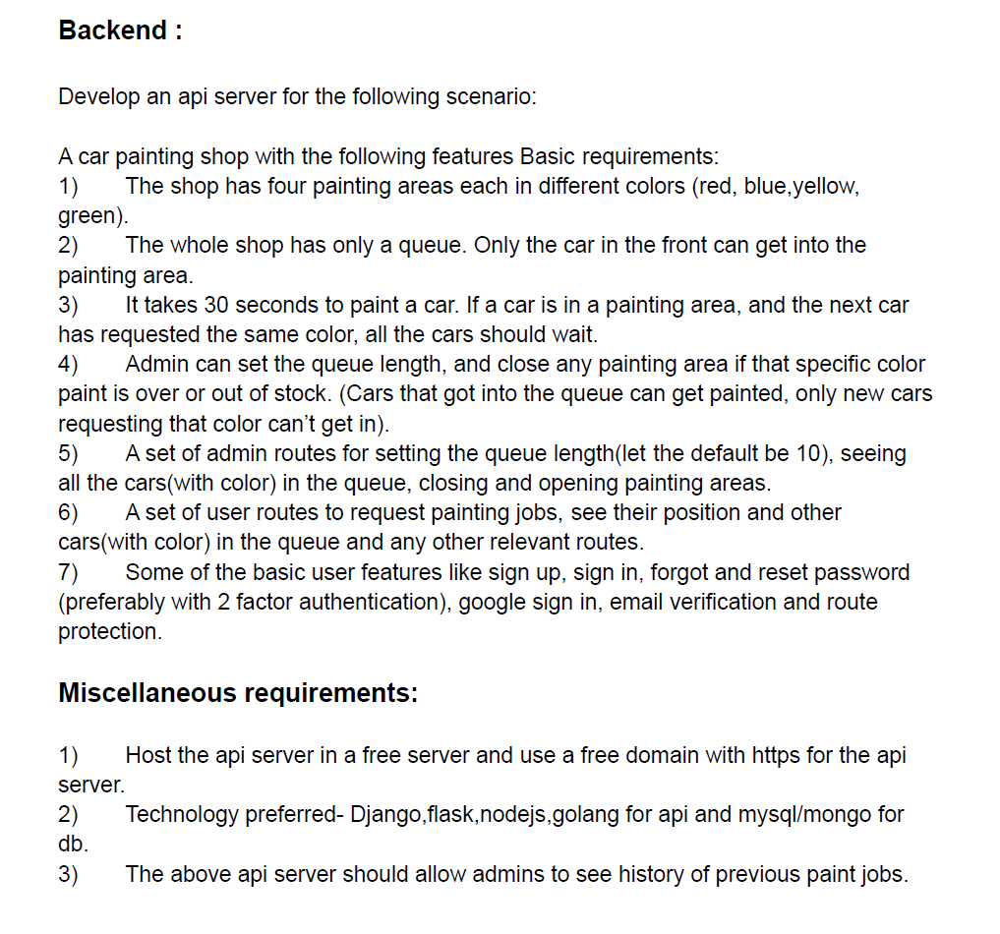

# CTF Student Director Recruitment Task



## API Docs
- [Postman Documentation](http://ctf-sd-task-paargav.herokuapp.com/api-docs) 

## Admin Login Credentials
Email | Password
------------ | -------------
admin1@gmail.com | admin1@password
admin2@gmail.com | admin2@password
admin3@gmail.com | admin3@password


## To run code in local machine
- Install [Python](https://www.youtube.com/watch?v=UvcQlPZ8ecA)
- Install [PostgreSQL](https://www.youtube.com/watch?v=e1MwsT5FJRQ)
- Setup your environment. Example env file ```env.example``` is given.  
- In project folder, ```pip install -r requirements.txt```
